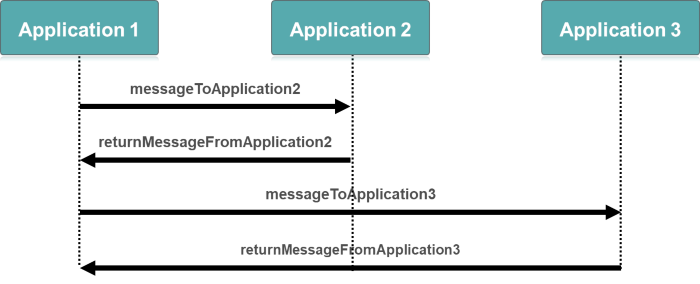

{{ page.description}}



In scenario planning, the IEPD stakeholders decide and agree on what will go into the package. This phase can take a long time to accomplish. The more thought and analysis you put into defining your requirements typically results in better schemas and support documents.

## Getting Started

Develop a high level scope and goal of the intended exchange. Decide what information needs to be a part of it. Interview stakeholders to gain an understanding of the information exchange environment. Stakeholders can include the organizations with whom you are exchanging information, community stakeholders in the same mission space, and practitioners from your organization.

Ask questions such as the following:

- What information do you want to exchange?
- What information do you exchange now?
- What information would you like to exchange in the future?
- Who are your exchange partners?
- Can you break the exchange down into several exchanges?
- How are your information exchanges currently specified?
- Does a repository have an IEPD similar or relevant to yours?
- Is there a subject matter expert, or a user group, that has relevant expertise?

Consider complicating factors:

- jurisdictional boundaries
- privacy concerns
- sharing restrictions
- identity of participants
- people problems
- technical characteristics (e.g., types of data, number of data objects, physical and logical data structure)
- use of external standards

An existing, small, simple exchange requires fewer exchange development resources than a new, big, poorly documented one.

## Scenario Model

An effective scenario is informative, strategic, and comprehensive. A model is a graphical representation of information exchange requirements and is essential to depict the scenario that will ultimately drive the building of the information exchange. Use diagrams to create business scenarios as an effective first step to accomplish this. Recommended diagram types include the following:

- **Use Case** - describes functionality.
- **Business Process** - describes activity sequencing.
- **Sequence** - describes message flow.

### Use Case Diagram Components

A use case diagram graphically represents the functionality of a particular information exchange as perceived by an external observer. It has the following components:

| **Actor** | Depicts system interactions; a role that a human, device, or system "plays" within the diagram. |
| **Use Case** | Depicts system functionality such as main or sub functionality, a user goal, or an activity system. |
| **Relationship** | Depicts the relationships actors have with use cases and each other. |
| **System** | Contains all functionality and limits scope of the diagram. |

### Use Case Diagram General Format

Several of these simple diagrams can form a [more complex diagram](/training/iepd-developer/scenario-planning).

### Business Process Diagram Components

A business process diagram shows the graphical and sequential activities involved in an exchange. It is similar to a workflow diagram and has the following components:

| **Stakeholder** | Any person, organization, or system directly or indirectly involved in the information exchange. |
| **Actvity** | Correlates the data being exchanged with any activity that drives it. |
| **Gateway-Event Based** | Activities that force a decision upon a stakeholder. |
| **Flow** | Connects business processes and events to show the direction of activities in the diagram. |
| **Start Event/Stop Event** | Acts as an activity trigger or represents the result or completion of an activity. |

### Business Process Diagram Development

1. Determine the number of stakeholders involved in the process for the information exchange. Analyze the scenario and identify them.
2. Create a box to serve as a frame to contain your diagram.
3. Divide the box into horizontal rows ("swim lanes") for each of the stakeholders in the process.
4. Draw a line dividing the header section to indicate each stakeholder from the section that will contain the stakeholder’s activities.
5. Insert each of the stakeholders into the header section so that they have their own "swim lane" in the diagram.
6. Create a starting node on the diagram in the far left of the swim lane for the stakeholder that initiates the process for the information exchange.
7. Fill in the business process diagram from left to right, beginning after the starting node, with each of the activities or events, in chronological order, involved in the information exchange.  Also make sure to insert a terminal node that indicates the end of the process.
8. Fill in the arrows that connect each of the activities in the diagram.
9. Review the diagram to ensure that it matches the process described in the scenario.

### Business Process Diagram General Format

### Sequence Diagram Components

A sequence diagram shows how applications or systems operate with one another. It displays the sequential order of operational processes or messages between applications as horizontal arrows between the parallel, vertical lines that are used for applications. This allows the specification of simple runtime scenarios in a graphical manner. A typical sequence diagram should include the following elements:

| **Applications** | Any application involved in sending messages within the information exchange. |
| **Messages** | Any message being sent between applications within the information exchange. |

### Sequence Diagram General Format

When you have answers to the questions and complications discussed earlier, and one or more detailed diagrams, you can
proceed to the next phase, [Analyze Requirements](/reference/iepd/lifecycle/analyze-requirements "Analyze Requirements").